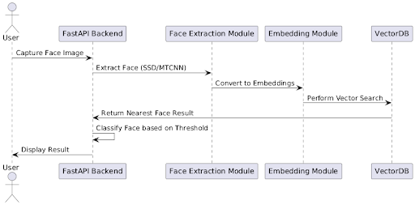

<h1> Face Recognition Project </h1>

**FaceRec** is an innovative face recognition project utilizing **Flask**, **FastAPI**, **DeepFace**, and **MongoDB** to create a Face recognition system. This application empowers users to register faces along with associated metadata, update their information, and delete their data, creating a comprehensive face recognition system.

<p align="center">
    <a href="https://github.com/devansh-shah-11/FaceRec/actions/workflows/python-app.yml"></a>
    <a href="https://github.com/devansh-shah-11/FaceRec/actions/workflows/codeql.yml"></a>
    <a href="https://codecov.io/gh/devansh-shah-11/FaceRec"></a>
    <a href="https://sonarcloud.io/dashboard?id=Devasy23_FaceRec"></a>
    <a href="https://sonarcloud.io/dashboard?id=Devasy23_FaceRec"></a>
    <a href="https://sonarcloud.io/dashboard?id=Devasy23_FaceRec"></a>
    <a href="https://sonarcloud.io/dashboard?id=Devasy23_FaceRec"></a>
    <a href="https://sonarcloud.io/dashboard?id=Devasy23_FaceRec"></a>
    <a href="https://sonarcloud.io/dashboard?id=Devasy23_FaceRec"></a>
    <a href="https://sonarcloud.io/dashboard?id=Devasy23_FaceRec"></a>
    <!-- <a href="https://sonarcloud.io/dashboard?id=Devasy23_FaceRec"></a> -->
    <a href="https://sonarcloud.io/dashboard?id=Devasy23_FaceRec"></a>
    <a href="https://sonarcloud.io/dashboard?id=Devasy23_FaceRec"></a>
    <a href="https://sonarcloud.io/dashboard?id=Devasy23_FaceRec"></a>
</p>

## 🚀 Features

- **Real-Time Face Recognition:** Detect and recognize faces seamlessly in real-time.
- **User-Friendly Interface:** Easy to use with a clean design for enhanced user experience.
- **Metadata Management:** Register, update, and delete face entries with ease.
- **Scalable Architecture:** Built to handle multiple users and extensive datasets.

## 📦 Getting Started

These instructions will guide you through setting up the project on your local machine for development.

### Prerequisites

Make sure you have **Python 3.10 or later** installed.

### Installation Steps

1. **Clone the Repository:**
   ```bash
   git clone https://github.com/Devasy23/FaceRec.git
   ```

2. **Navigate to the Project Directory:**
   ```bash
   cd FaceRec
   ```

3. **Install the Required Packages:**
   ```bash
   pip install -r requirements.txt
   ```

### Running the Server

To start the Flask and FastAPI applications, run the following command:
```bash
python main.py
```

Your application will be available at `http://localhost:5000`.

<details>
<summary> <span style="font-size: 1.5em;"><strong>Project Structure</strong></span></summary>

- `requirements.txt`: Contains the Python dependencies for the project.
- `API/`: Contains the code for the FastAPI application.
- `FaceRec/`: Contains all files related to the HTML, CSS, and Flask application.
- `Model-Training/`: Contains scripts for training models.
- `docs/`: Contains documentation files.
- `test-faces/`: Contains test data for face recognition.
- `main.py`: Contains code to start both FastAPI and Flask applications.

</details>

## Function Flow

1. `create_new_faceEntry()`: Receives a POST request with an image and metadata. It extracts the face, calculates the embeddings, and stores the data in the database.
2. `Data()`: Sends a GET request to the `/data` endpoint of the FastAPI app to get the list of Face Entries from MongoDB.
3. `update()`: Updates the details of the face entry in the database.
4. `read()`: Sends a GET request with a specific `Employeecode` to read the related information.
5. `delete()`: Deletes the specific employee data.

## Sequence Diagram



## 🗄️ Database Schema

1. **Create a New Connection in MongoDB** using the following URL:
   ```
   mongodb://localhost:27017/8000
   ```

2. **Create a Database:**
   - **Database Name**: `DatabaseName`
   - **Collection Name**: `CollectionName`

3. **Import Data by Using a JSON File:**
   - From the `database.mongo` folder -> `{DatabaseName}.{CollectionName}.json`

### The `faceEntries` Collection Schema:

- `id`: A unique identifier for the face entry.
- `Employeecode`: A unique employee ID associated with the image.
- `Name`: The name of the person in the image.
- `gender`: The gender of the person.
- `Department`: The department of the person.
- `time`: The timestamp of when the face entry was created.
- `embeddings`: The embeddings of the face image.
- `Image`: Base64 encoded image file.

## 🔄 Function Flow

1. **`create_new_faceEntry()`**: Receives a POST request with an image and metadata. It extracts the face from the image, calculates the embeddings, and stores the data in the database.
  
2. **`Data()`**: Sends a GET request to the `/data` endpoint of the FastAPI app to retrieve the list of face entries from MongoDB.
  
3. **`update()`**: Updates the details of a face entry in the database.
  
4. **`read()`**: Sends a GET request with a specific `Employeecode` to retrieve related information.
  
5. **`delete()`**: Deletes a specific employee's data from the database.

## 🧪 Testing

To run the tests for this project, use the following command:
```bash
pytest
```

## 👥 Our Valuable Contributors ❤️✨
Thanks to all the amazing people who have contributed to **FaceRec**! 💖

[](https://github.com/Devasy23/FaceRec/graphs/contributor)

## 📄 Documentation

For detailed API documentation, please refer to the [API Documentation](API_DOCUMENTATION.md) file.


## 📄 License

This project is licensed under the **APACHE License** - see the [LICENSE](LICENSE) file for details.

## deeptune: A Python Package for Model Fine-Tuning and Training

`deeptune` is a Python package designed to help you fine-tune and train models of siamese architecture. It provides different backend options and loss functions like triplet loss and arcface loss.

### Features

- **Model Fine-Tuning:** Fine-tune pre-trained models with ease.
- **Training:** Train models with different backend options and loss functions.
- **Evaluation:** Evaluate models using various metrics.
- **CLI Support:** Interact with the package through the command line.

### Installation

To install the package, clone the repository and install the required packages:

```bash
git clone https://github.com/Devasy23/FaceRec.git
cd FaceRec/deeptune
pip install -r requirements.txt
```

### Usage

#### Command-Line Interface (CLI)

The package provides a CLI to interact with the model fine-tuning and training functionalities.

To evaluate a model, use the following command:

```bash
python -m deeptune.cli.cli evaluate_model <model_path> <dataset_path>
```

Replace `<model_path>` with the path to your model file and `<dataset_path>` with the path to your dataset.

#### Example

Here is an example of how to use the package in your Python code:

```python
from deeptune.evaluation.eval_mark_I import (
    load_and_preprocess_image,
    generate_embeddings,
    calculate_intra_cluster_distances,
)
from keras.models import load_model
import numpy as np

# Load the pre-trained model
model_path = "path_to_your_model.h5"
model = load_model(model_path)

# Path to the dataset
dataset_path = "path_to_your_dataset"

# Generate embeddings
embeddings, labels = generate_embeddings(model, dataset_path)

# Calculate intra-cluster distances
intra_distances = calculate_intra_cluster_distances(embeddings, labels)

# Output the results
print(f"Intra-Cluster Distances: {intra_distances}")
print(f"Mean Distance: {np.mean(intra_distances)}")
```

### Project Structure

- `deeptune/`: Main package directory.
  - `__init__.py`: Makes `deeptune` a Python package.
  - `data/`: Sub-package for data-related functionalities.
  - `models/`: Sub-package for model-related functionalities.
  - `training/`: Sub-package for training-related functionalities.
  - `evaluation/`: Sub-package for evaluation-related functionalities.
  - `utils/`: Sub-package for utility functions.
  - `cli/`: Sub-package for CLI-related functionalities.
  - `config.py`: Configuration file for storing settings or parameters.
  - `requirements.txt`: Lists the dependencies for the package.
  - `cli/cli.py`: CLI script to interact with the package.

### License

This project is licensed under the **APACHE License** - see the [LICENSE](LICENSE) file for details.
